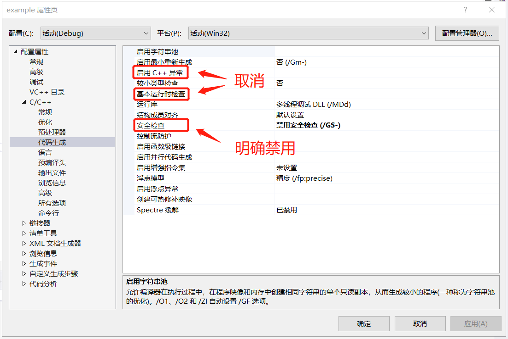
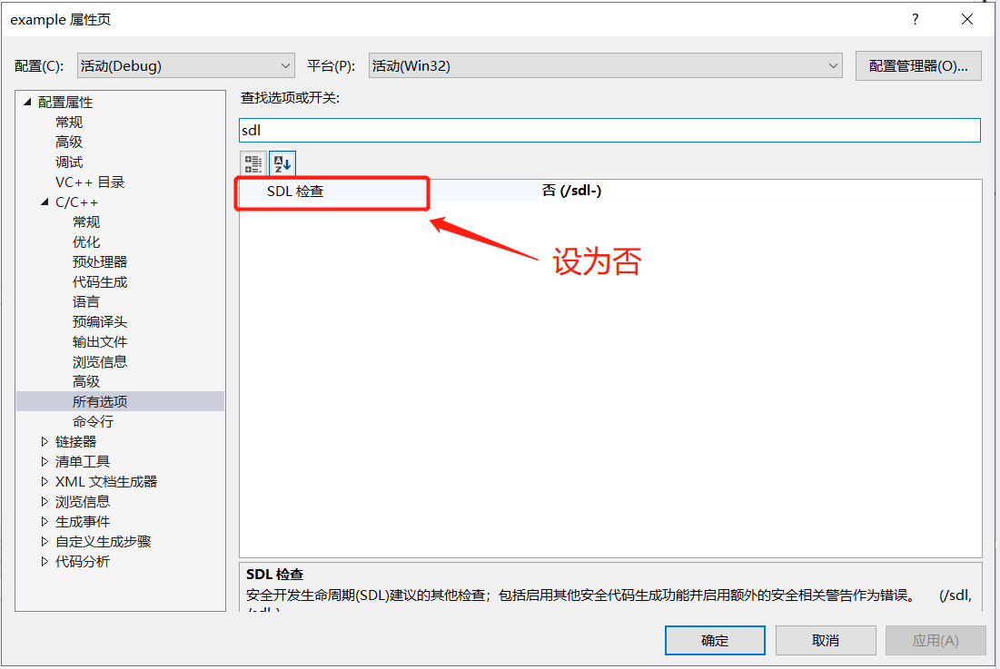
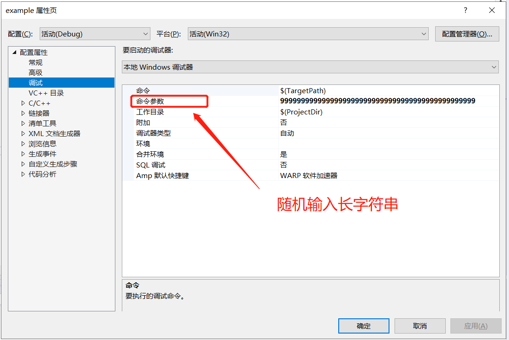
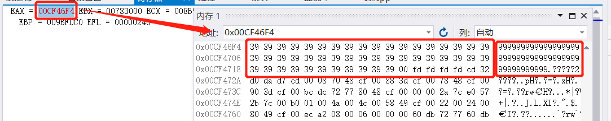
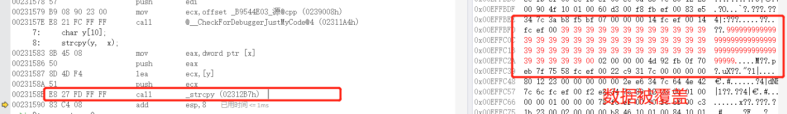
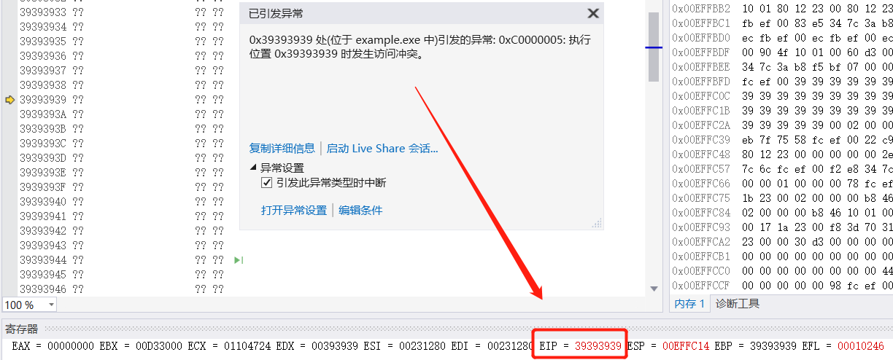
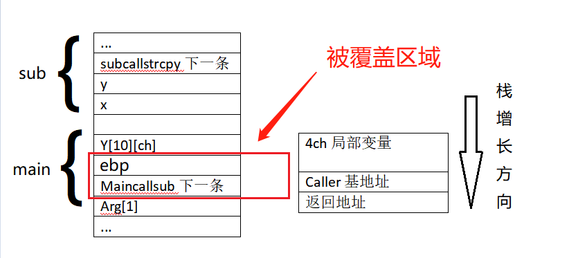

# 实验一  二进制缓冲区溢出

## 实验代码

```c
#include <stdlib.h>
#include <stdio.h>
#include <string.h>

int sub(char* x)
{
	char y[10];
	strcpy(y,  x);
	return 0;
}

int main(int argc, char** argv)
{
	char y[10];
	if (argc > 1) 
		sub(argv[1]);
	printf("exit");
}
```

## 实验配置

>**配置属性是为了让vs编译器不会因我们代码里安全威胁而不予以生成**
>
>配置属性：
>
>c/c++ -- 代码生成 -- 启用c++（取消），基本运行时检查（取消），安全检查（明确禁用）
>
>c/c++ -- 所有选项 -- SDL设为否
>
>调试   -- 命令参数 -- 输入长字符串：例99999999999999999999999999999999999999999999999 








## 调试分析

- 进行调试分析时，我们打开 内存、反汇编及寄存器窗口 

- **EIP、EBP、ESP的作用**

  EIP存储着下一条指令的地址，每执行一条指令，该寄存器变化一次

  EBP存储着当前函数栈底地址，栈底通常作为基址，可以通过栈底地址和偏移相加减获取变量地址

  ESP始终指向栈顶，ESP指向变了，那么当前栈顶就变了


### 函数入栈

#### 反汇编代码

```assembly
--- C:\Users\ASUS\Desktop\example\源.cpp ---------------------------------------

int main(int argc, char** argv)
{
00131630 55                   push        ebp  ;将调用main函数的栈底指针入栈
00131631 8B EC                mov         ebp,esp  ；让ebp指向main函数栈底
00131633 83 EC 4C             sub         esp,4Ch  ；给main函数开辟栈帧
00131636 53                   push        ebx  
00131637 56                   push        esi  
00131638 57                   push        edi  ；压入三个寄存器
00131639 B9 08 90 13 00       mov         ecx,offset _B9544E03_源@cpp (0139008h) 
0013163E E8 61 FB FF FF       call        @__CheckForDebuggerJustMyCode@4 (01311A4h)  
	char y[10];
	if (argc > 1) 
00131643 83 7D 08 01          cmp         dword ptr [argc],1  
00131647 7E 17                jle         main+30h (0131660h)  
		sub(argv[1]);
00131649 B8 04 00 00 00       mov         eax,4  
0013164E C1 E0 00             shl         eax,0  
00131651 8B 4D 0C             mov         ecx,dword ptr [argv]  
00131654 8B 14 01             mov         edx,dword ptr [ecx+eax] 
00131657 52                   push        edx ；参数入栈
00131658 E8 93 FA FF FF       call        strcpy_s<10> (01310F0h)  ；调用函数，在这之前将下一行指令的地址入栈
0013165D 83 C4 04             add         esp,4  ；回退形参变量所占内存
	printf("exit");
00131660 68 30 5B 13 00       push        offset string "exit" (0135B30h)  
00131665 E8 CD F9 FF FF       call        _main (0131037h)  
0013166A 83 C4 04             add         esp,4  

}
0013166D 33 C0                xor         eax,eax  

}
0013166F 5F                   pop         edi  
00131670 5E                   pop         esi  
00131671 5B                   pop         ebx  
00131672 8B E5                mov         esp,ebp  
00131674 5D                   pop         ebp  
00131675 C3                   ret  
```

```assembly

int sub(char* x)
{
00131570 55                   push        ebp  
00131571 8B EC                mov         ebp,esp  
00131573 83 EC 4C             sub         esp,4Ch  ；分配栈帧空间
00131576 53                   push        ebx  
00131577 56                   push        esi  
00131578 57                   push        edi  
00131579 B9 08 90 13 00       mov         ecx,offset _B9544E03_源@cpp (0139008h)  
0013157E E8 21 FC FF FF       call        @__CheckForDebuggerJustMyCode@4 (01311A4h)  
	char y[10];
	strcpy(y,  x);
00131583 8B 45 08             mov         eax,dword ptr [x]  
00131586 50                   push        eax  
00131587 8D 4D F4             lea         ecx,[y]  
0013158A 51                   push        ecx  
0013158B E8 27 FD FF FF       call        _strcpy (01312B7h)  
00131590 83 C4 08             add         esp,8  
	return 0;
00131593 33 C0                xor         eax,eax  
}
00131595 5F                   pop         edi  
00131596 5E                   pop         esi  
00131597 5B                   pop         ebx  
00131598 8B E5                mov         esp,ebp  
0013159A 5D                   pop         ebp  
0013159B C3                   ret  
```


#### 栈溢出运行结果








#### 栈溢出过程




## 实验总结

缓冲区溢出通过往程序的缓冲区写超出其长度的内容，造成缓冲区的溢出，从而破坏程序的堆栈，造成程序崩溃或使程序转而执行其它指令，以达到攻击的目的。造成缓冲区溢出的主要原因是程序中没有仔细检查用户输入的参数是否合法。

由于栈是低地址方向增长的，因此局部数组buffer的指针在缓冲区的下方。当把data的数据拷贝到buffer内时，超过缓冲区区域的高地址部分数据会“淹没”原本的其他栈帧数据，根据淹没数据的内容不同，会产生不同的情况：

- 淹没了其他的局部变量。如果被淹没的局部变量是条件变量，那么可能会改变函数原本的执行流程。这种方式可以用于破解简单的软件验证。

- 淹没了ebp的值。修改了函数执行结束后要恢复的栈指针，将会导致栈帧失去平衡。

- 淹没了返回地址。这是栈溢出原理的核心所在，通过淹没的方式修改函数的返回地址，使程序代码执行“意外”的流程！

- 淹没参数变量。修改函数的参数变量也可能改变当前函数的执行结果和流程。

- 淹没上级函数的栈帧，情况与上述4点类似，只不过影响的是上级函数的执行。当然这里的前提是保证函数能正常返回，即函数地址不能被随意修改（这可能很麻烦！）。

