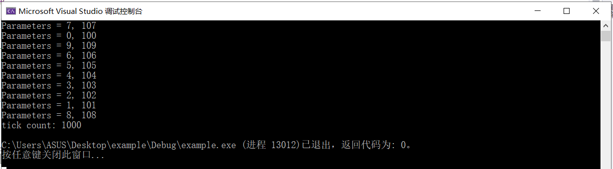
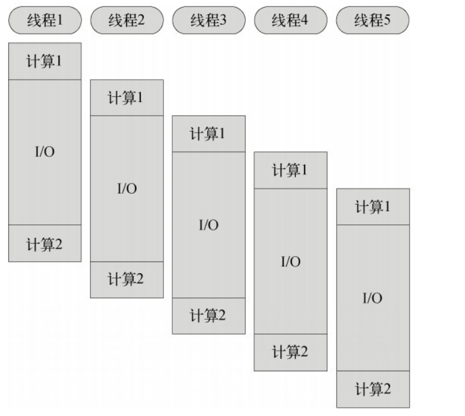
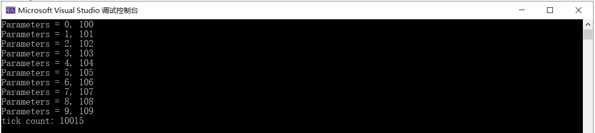
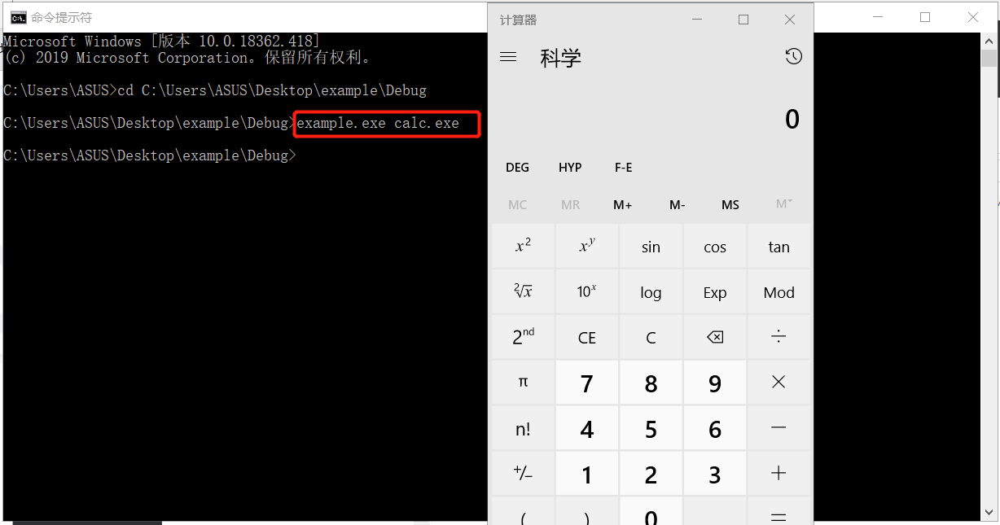
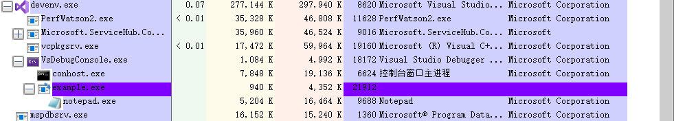
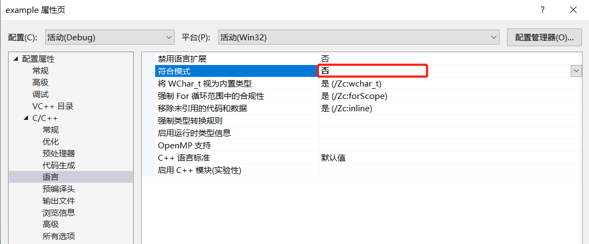

# 实验二  线程与进程

## 一、线程

### 1、实验代码

```c++
#include <windows.h>
#include <tchar.h>
#include <strsafe.h>

#define MAX_THREADS 10
#define BUF_SIZE 255
#define MULTI_THREAD  //注释掉这一行宏定义即为单线程

DWORD WINAPI MyThreadFunction(LPVOID lpParam);

// Sample custom data structure for threads to use.
// This is passed by void pointer so it can be any data type
// that can be passed using a single void pointer (LPVOID).
typedef struct MyData {
	int val1;
	int val2;
} MYDATA, * PMYDATA;


int _tmain()
{
	PMYDATA pDataArray[MAX_THREADS];
#ifdef MULTI_THREAD
	DWORD   dwThreadIdArray[MAX_THREADS];
	HANDLE  hThreadArray[MAX_THREADS];
#endif

	// Create MAX_THREADS worker threads.

	DWORD start = GetTickCount();

	for (int i = 0; i < MAX_THREADS; i++)
	{
		// Allocate memory for thread data.
		pDataArray[i] = (PMYDATA)malloc(sizeof(MYDATA));

		if (pDataArray[i] == NULL)
		{
			// If the array allocation fails, the system is out of memory
			// so there is no point in trying to print an error message.
			// Just terminate execution.
			ExitProcess(2);
		}

		// Generate unique data for each thread to work with.
		pDataArray[i]->val1 = i;
		pDataArray[i]->val2 = i + 100;

		// Create the thread to begin execution on its own.		
#ifdef MULTI_THREAD

		hThreadArray[i] = CreateThread(
			NULL,                   // default security attributes
			0,                      // use default stack size  
			MyThreadFunction,       // thread function name
			pDataArray[i],          // argument to thread function 
			0,                      // use default creation flags 
			&dwThreadIdArray[i]);   // returns the thread identifier 

		// Check the return value for success.
		// If CreateThread fails, terminate execution. 
		// This will automatically clean up threads and memory. 
		if (hThreadArray[i] == NULL)
		{
			printf("CreateThread Error(%d)", GetLastError());
			ExitProcess(3);
		}
#else
		MyThreadFunction(pDataArray[i]);
#endif
	} // End of main thread creation loop.

	// Wait until all threads have terminated.
#ifdef MULTI_THREAD
	WaitForMultipleObjects(MAX_THREADS, hThreadArray, TRUE, INFINITE);
#endif

	DWORD end = GetTickCount();
	printf("tick count: %d\n", end - start);

	// Close all thread handles and free memory allocations.
#ifdef MULTI_THREAD

	for (int i = 0; i < MAX_THREADS; i++)
	{
		CloseHandle(hThreadArray[i]);
		if (pDataArray[i] != NULL)
		{
			free(pDataArray[i]);
			pDataArray[i] = NULL;    // Ensure address is not reused.
		}
	}
#endif
	return 0;
}


DWORD WINAPI MyThreadFunction(LPVOID lpParam)
{
	PMYDATA pDataArray;
	pDataArray = (PMYDATA)lpParam;
	Sleep(1000);
	printf("Parameters = %d, %d\n", pDataArray->val1, pDataArray->val2);
	return 0;
}
```

### 2、实验步骤

#### 多线程

- 运行上述代码实现多线程

  

- **多线程**：一个程序中可以同时运行多个不同的线程来执行不同的任务，也就是说允许单个程序创建多个并行执行的线程来完成各自的任务。可以提高CPU的利用率。在多线程程序中，一个线程必须等待的时候，CPU可以运行其它的线程而不是等待，这样就大大提高了程序的效率。

- **同步**：进程之间的关系不是相互排斥临界资源的关系，而是相互依赖的关系。进一步的说明：就是前一个进程的输出作为后一个进程的输入，当第一个进程没有输出时第二个进程必须等待。具有同步关系的一组并发进程相互发送的信息称为消息或事件。简单来说同步就是顺序执行，执行完一个再执行下一个，需要等待、协调运行。

- 多线程同步图

  

#### 单线程

- 注释源代码 `  #define MULTI_THREAD  `  这一行宏定义实现单线程

  

- **单线程**：单线程就是进程只有一个线程，线程一个一个执行

- **异步**：异步就是彼此独立,在等待某事件的过程中继续做自己的事，不需要等待这一事件完成后再工作。


## 二、进程

### 1、实验代码

```c++
#include <windows.h>
#include <stdio.h>
#include <tchar.h>

void _tmain(int argc, TCHAR* argv[])
{
	STARTUPINFO si;
	PROCESS_INFORMATION pi;

	ZeroMemory(&si, sizeof(si));
	si.cb = sizeof(si);
	ZeroMemory(&pi, sizeof(pi));

	if (argc != 2)
	{
		printf("Usage: %s [cmdline]\n", argv[0]);
		return;
	}

	// Start the child process. 
	if (!CreateProcess(NULL,   // No module name (use command line)
		argv[1],        // Command line
		NULL,           // Process handle not inheritable
		NULL,           // Thread handle not inheritable
		FALSE,          // Set handle inheritance to FALSE
		0,              // No creation flags
		NULL,           // Use parent's environment block
		NULL,           // Use parent's starting directory 
		&si,            // Pointer to STARTUPINFO structure
		&pi)           // Pointer to PROCESS_INFORMATION structure
		)
	{
		printf("CreateProcess failed (%d).\n", GetLastError());
		return;
	}

	// Wait until child process exits.
	WaitForSingleObject(pi.hProcess, INFINITE);

	// Close process and thread handles. 
	CloseHandle(pi.hProcess);
	CloseHandle(pi.hThread);
}
```


### 2、实验步骤

#### 创建进程  

- 以上源代码生成调试生成.exe文件，用cmd运行命令创建进程，打开计算器

  

#### 父子进程

- 下载 process Explorer：可以看进程的链表以及进程的父子关系

- 父进程和子进程的关系是子进程是父进程的一个副本，创建子进程后，子进程会有自己的空间，然后把父进程的数据拷贝到子进程的空间里，运行时，谁先运行是不确定的

- 用vs调试打开记事本，即运行notepad.exe，可以发现它是程序example.exe的子进程

  


## 遇到的问题

- 报错:"const char *" 类型的实参与 "char *" 类型的形参不兼容之类的错误, 函数形参为char*的类型直接写入字符串也会报错, 在 : 项目属性->C/C++->语言->符合模式项->否

  


## 参考资料

[CreateThread function](https://docs.microsoft.com/en-us/windows/win32/api/processthreadsapi/nf-processthreadsapi-createthread) 

[CreateProcessA function](https://docs.microsoft.com/en-us/windows/win32/api/processthreadsapi/nf-processthreadsapi-createprocessa) 


