# 动态链接库和模块遍历

## 实验工具

Virtual Studio2019

Virtual Studio 自带的 dumpbin工具

[Process Explorer 16.30](https://docs.microsoft.com/en-us/sysinternals/downloads/process-explorer) 

[Dependency Walker 2.2](http://www.dependencywalker.com/) 


## 实验内容

- [x] 1、编写dll。把.c文件编译为obj文件，把obj文件和lib文件链接为新的dll和lib文件。注意使用def文件定义导出函数。
- [x] 2、编写一个exe，调用第一步生成的dll文件中的导出函数。方法是（1）link是，将第一步生成的lib文件作为输入文件。（2）保证dll文件和exe文件在同一个目录，或者dll文件在系统目录。
- [x] 3、第二步调用方式称为load time 特点是exe文件导入表中会出先需要调用的dll文件名及函数名，并且在link 生成exe是，需明确输入lib文件。还有一种调用方式称为 run time,参考这个 [链接](https://docs.microsoft.com/zh-cn/windows/win32/dlls/using-run-time-dynamic-linking) ，使用run time的方式，调用dll的导出函数。包括系统API和第一步自行生成的dll，都要能成功调用。
- [x] 4、模块遍历；学会使用三个工具，Dumpbin，Process Explorer，Dependency Walker

## 实验步骤

### 一、编写dll

#### 1、编写一个base.c文件和exp.def文件

注意是c文件，cpp文件可能会出错

```c
// base.c
#include<Windows.h>
int intnal_function()
{
	return 0;
}

int lib_function(char* msg) 
{
	MessageBoxA(0, "msg from base lib", msg, MB_OK);
	return 0;
}
```

```c
；exp.def
；LIBRARY语句说明.def文件相应的DLL
；EXPORTS语句后列出要导出函数的名称
；.def文件中的注释由每个注释行开始处的分号指定，且注释不能与语句共享一行

LIBRARY    baselib  
EXPORTS             
   lib_function        
```


#### 2、把.c文件编译为obj文件

vs  >>  工具  >>  命令行(L)  >>  开发者 PowerShell(P)

命令： cl.exe /c base.c 

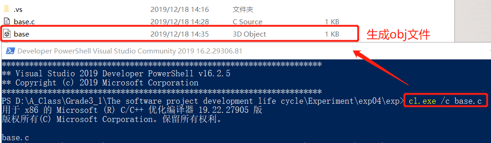


#### 3、把obj文件和lib文件链接为新的dll和lib文件

命令： link base.obj User32.lib  /dll /def:exp.def

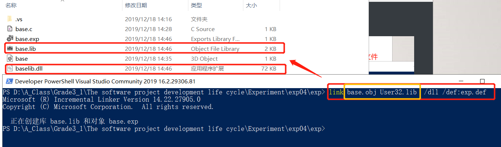


#### 4、用def文件定义导出函数

DLL中导出函数的声明有两种方式：一种为在函数声明中加上__declspec(dllexport)；另外一种方式是采用模块定义(.def) 文件声明，.def文件为链接器提供了有关被链接程序的导出、属性及其他方面的信息。

先前我们在.def文件定义的时候只导出了函数lib_function()，所以虽然代码编写了两个函数，函数intnal_function()没有被导出。

命令：dumpbin /exports baselib.dll

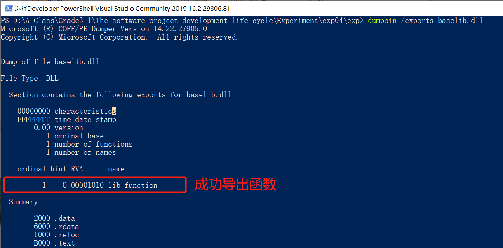


#### 5、使用vs直接进行编译

首先，在工程里直接编译出错，无法解析main()

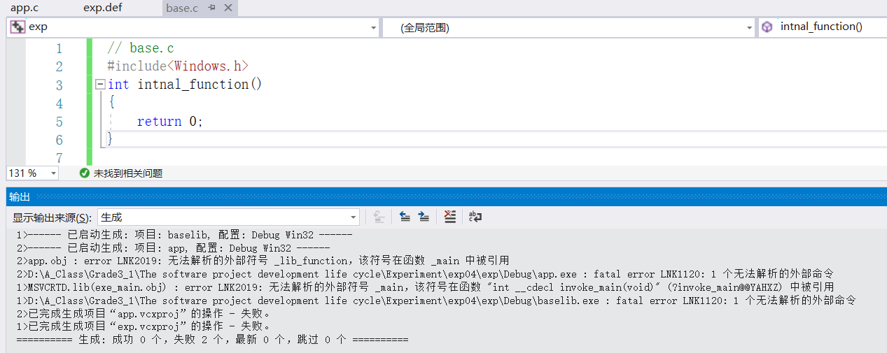


**更改项目属性** 

配置属性  >>  常规  >>  配置类型  >>  动态库（.dll）

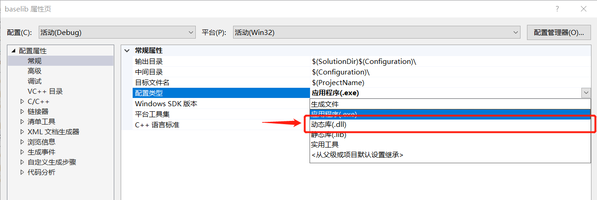

配置属性  >>  链接器  >>  输入  >>  模块定义文件  >>  exp.def

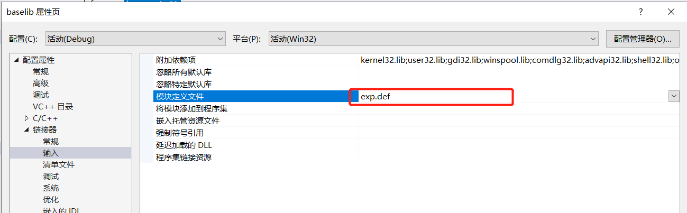

编译成功，得到.dll文件和.lib文件

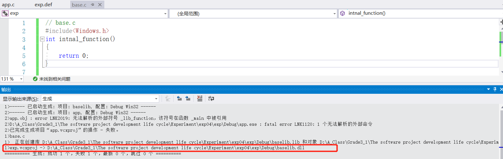


### 二、编写exe，使用 load time 的方式

#### 1、创建一个新项目，编写app.c

```c
// app.c
int main()
{
	lib_function("成功啦！！！");
	return 0;
}
```


#### 2、将.c 文件编译为 .obj 文件

命令： cl.exe /c app.c

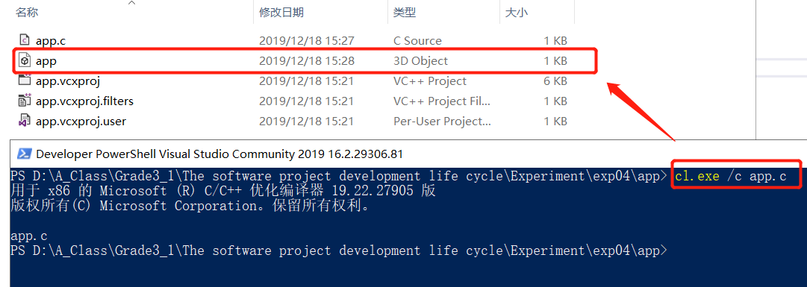


#### 3、链接.obj文件和.lib文件生成.exe文件

命令： link app.obj ..\exp\base.lib User32.lib /out:app.exe

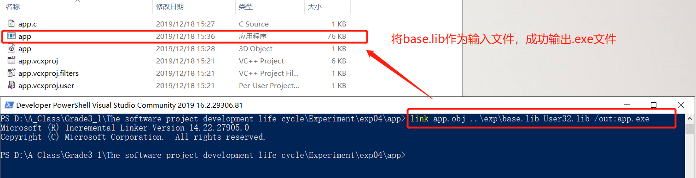


4、将base.dll文件放入.exe文件目录下，即可成功运行

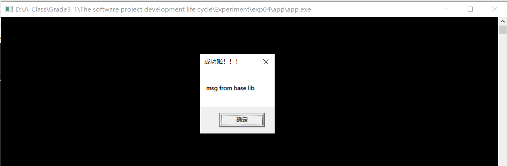

### 三、编写exe，使用 run time 的方式

实验要求：

- 使用run time的方式，调用dll的导出函数
- 系统API和第一步自行生成的dll，都要能成功调用

#### 1、根据[参考链接](https://docs.microsoft.com/zh-cn/windows/win32/dlls/using-run-time-dynamic-linking) ，编写runtime.c文件

```c
// A simple program that uses LoadLibrary and 
// GetProcAddress to access myPuts from Myputs.dll. 

#include <windows.h> 
#include <stdio.h> 

typedef int(__cdecl *MYPROC)(LPWSTR);

int main(void)
{
	HINSTANCE hinstLib;
	MYPROC ProcAdd;
	BOOL fFreeResult, fRunTimeLinkSuccess = FALSE;

	// Get a handle to the DLL module.
	hinstLib = LoadLibrary(TEXT("baselib.dll"));

	// If the handle is valid, try to get the function address.
	if (hinstLib != NULL)
	{
		ProcAdd = (MYPROC)GetProcAddress(hinstLib, "lib_function");

		// If the function address is valid, call the function.
		if (NULL != ProcAdd)
		{
			fRunTimeLinkSuccess = TRUE;
			(ProcAdd)("call dll!");
		}
		// Free the DLL module.
		fFreeResult = FreeLibrary(hinstLib);
	}

	// If unable to call the DLL function, use an alternative.
	if (!fRunTimeLinkSuccess)
		printf("Message printed from executable\n");

	return 0;
}
```


#### 2、对 runtime.c 直接进行编译

命令： cl runtime.c  ，生成 .obj 和 .exe 文件

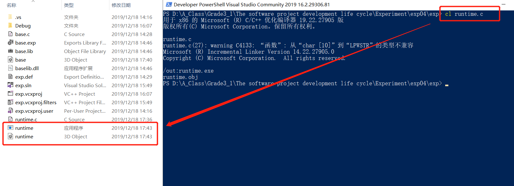

运行结果：

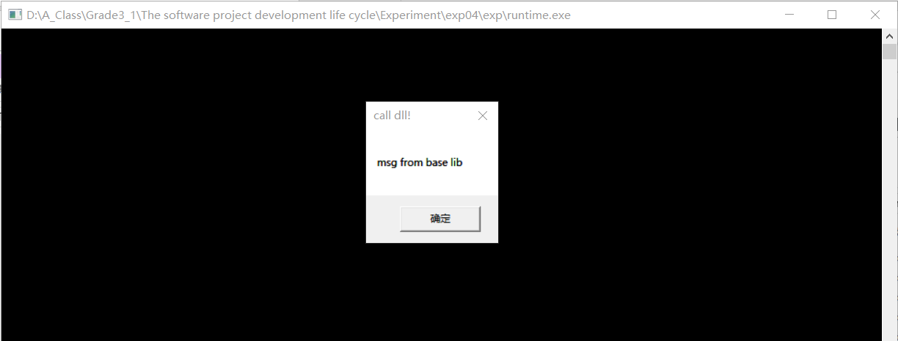


#### 3、实验小结

- LoadLibrary函数用于获取指定DLL的句柄。如果LoadLibrary成功，则使用GetProcAddress函数返回DLL句柄的某一指定函数的地址。调用DLL函数后，程序将调用FreeLibrary函数以卸载DLL。
- 当应用程序调用LoadLibrary函数时，系统会尝试定位DLL（方式和载入时动态链接的定位过程一致：①应用程序载入目录 ②当前目录 ③系统目录 等）。如果找到，系统就把DLL模块映射到进程的虚地址空间中，并增加引用计数。


### 四、模块遍历

#### 1、遍历当前系统的所有进程

 根据[参考链接](https://docs.microsoft.com/zh-cn/windows/win32/toolhelp/taking-a-snapshot-and-viewing-processes) ，我们编写程序输出当前运行的所有进程，执行结果如下图，输出当前快照下所有的进程信息，并按PID排序（这里记得加两个头文件<stdio.h><stdlib.h>，注释多余的输出）

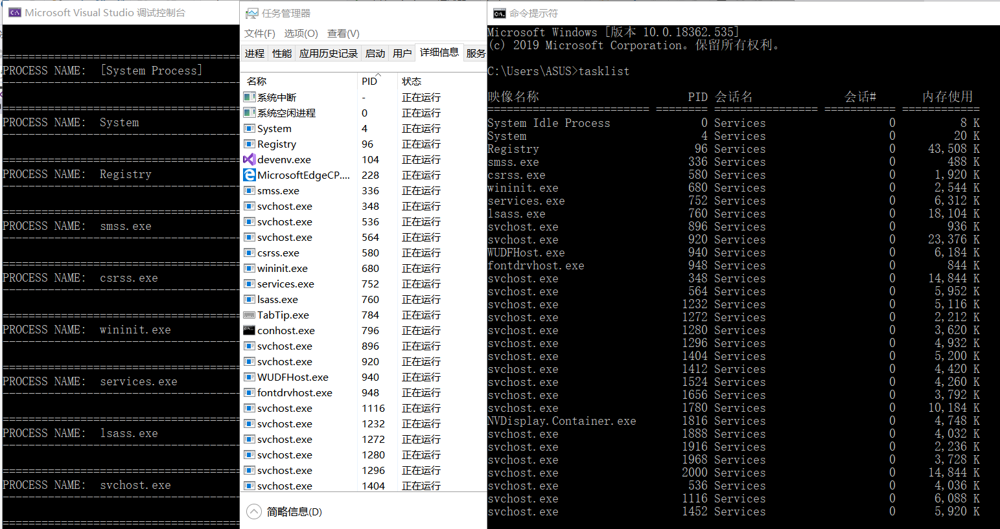


#### 2、分别使用三个工具查看app.exe

**Dependency Walker**

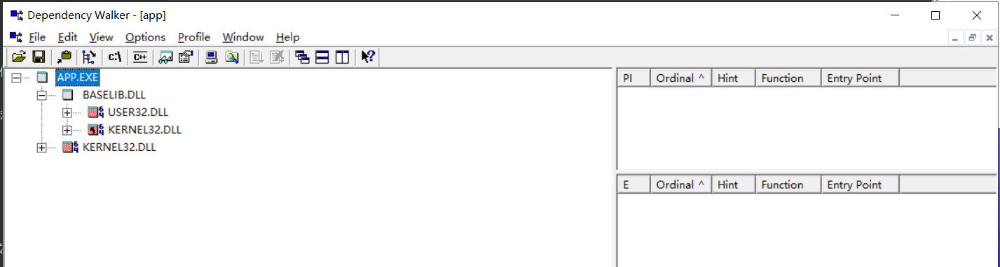

**Dumpbin**

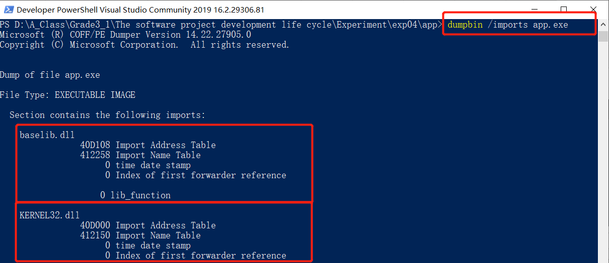

**Process Explorer**


通过以上三个工具，我们可以查看到app.exe确实调用了动态链接库baselib.dll


## 实验总结

#### load time & run time

- 装入时动态链接(Load-Time Dynamic Linking)

  - 用户源程序经编译后所得的目标模块，是在装入内存时边装入边链接的，即在装入一个目标模块时，若发生一个外部模块调用事件，将引起装入程序去找出相应的外部目标模块，并将它装入内存，还要修改目标模块中的相对地址。
  - 装入时动态链接方式有以下优点：
    -  便于修改和更新。采用动态链接方式，由于各目标模块是分开存放的，所以要修改或更新各目标模块是件非常容易的事。
    - 便于实现对目标模块的共享。在采用静态链接方式时，每个应用模块都必须含有其目标模块的拷贝，无法实现对目标模块的共享。但采用装入时动态链接方式，OS则很容易将一个目标模块链接到几个应用模块上，实现多个应用程序对该模块的共享。

  

- 运行时动态链接（Run –Time Dynamic Linking）
  - 在许多情况下，应用程序在运行时，每次要运行的模块可能是不相同的。但由于事先无法知道本次要运行哪些模块，故只能是将所有可能要运行到的模块都全部装入内存，并在装入时全部链接在一起。显然这是低效的，运行时动态链接方式，是对上述链接方式的一种改进。
  - 将对某些模块的链接推迟到程序执行时才进行链接，即在执行过程中，当发现一个被调用模块尚未装入内存时，立即由OS去找到该模块并将之装入内存，把它链接到调用者模块上。凡在执行过程中未被用到的目标模块，都不会被调入内存和被链接到装入模块上，这样不仅可加快程序的装入过程，而且可节省大量的内存空间。


    


