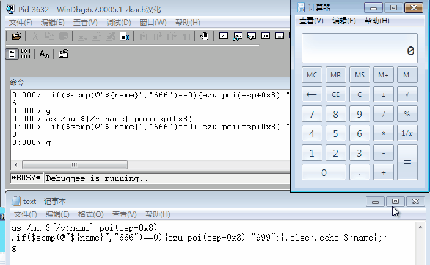
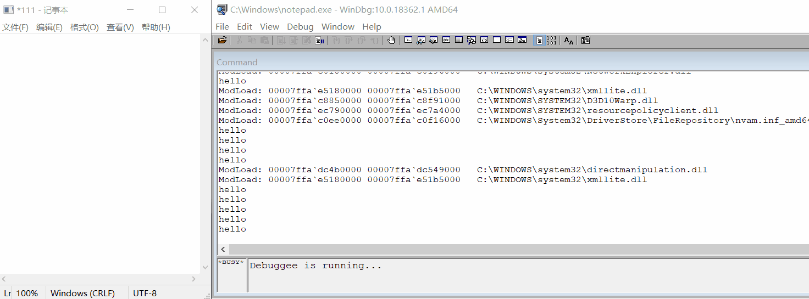

# 实验三 WinDBG调试计算机


## 实验环境

- 虚拟机：Windows 7 专业版 32位 
- WinDbg(X86)

## 实验思路

提示：找到运行结果在内存中保存的地址。监控 “=” 按键消息等。

- 使用 `dumpbin /imports calc.exe > calc.txt` 知道调用了SetWindowstextW函数

- 查原型可知第二个参数是显示的内容, 所以在其每次被调用前判断或修改第二个参数的值

## 实验步骤

1、在虚拟机中打开计算器，打开WinDbg，附加到进程

2、创建一个文本文件 text.txt

```bash
#新定义一个别名为name 将 poi（esp+0x8）处的 unicode字符串取出
as /mu ${/v:name} poi(esp+0x8)  

#进行字符串比较 如果name和666相同就改为999,否则输出name;ezu把后面的值改为再后面的内容
.if($scmp(@"${name}","666")==0){ezu poi(esp+0x8) "999";}.else{.echo ${name};}

#程序继续运行
g
```

3、下断点，在windbg中输入指令 `bp SetWindowTextW "$<C:\\text.txt"`, `g` 执行text.txt文件中的脚本。当计算器中显示为666时，被修改为999。




---

# 延伸实验 WinDBG调试记事本

## 实验环境

- Windows 10 家庭版 64位 
- WinDbg(X64)

## 实验步骤

1、打开WinDbg，连接notepad.exe （使用Windows下的exe）

2、每次保存记事本都输出hello

bu kernelbase!writefile ".echo hello;g" #下断点，每次到断点执行

#之后再g，执行文件，自动打开记事本，每次保存记事本都输出hello



3、保存特定字符时，输出hacked，暂定特定字符为123456

bu kernelbase!writefile "$$><c:\\Users\\ASUS\\Desktop\\text.txt"

```bash
as /mu content poi(esp+0n24)
.block{.if($scmp("${content}","123456")==0){ezu poi(esp+0n24) "hacked";}.else{.echo content}}
g
#text.txt
#poi访问该地址的值，content是一个别名
#block确保content内容正确展开；ezu把后面的值改为再后面的内容，如果输入非123456，就不会有变动
```

输入123456保存，输出hacked，其他则不变


### 指令集

| 指令     | 作用                                       |
| :------- | :----------------------------------------- |
| .symfix  | 指定本地缓存目录                           |
| .sympath | 设置符号路径，包括本地缓存和远程符号服务器 |
| .reload  | 重新加载模板                               |
| x        | 查看模块符号                               |
| bu       | 下断点                                     |
| bl       | 列出断点                                   |
| g        | 继续执行程序                               |
| k        | 查看调用堆栈                               |
| lm       | 列出当前进程加载的模块                     |

### 调试脚本

脚本是一系列的调试命令组合而成的文本文件，通过调试脚本，用户实现自动化的调试和修改程序执行流程。

| 命令    | 文件名包含分号 | 与其他命令相连 | 缩短命令为一行 | 允许传递参数 |
| :------ | :------------- | :------------- | :------------- | :----------- |
| `$<`    | 是             | 否             | 否             | 否           |
| `$><`   | 是             | 否             | 是             | 否           |
| `$$<`   | 否             | 是             | 否             | 否           |
| `$$><`  | 否             | 是             | 是             | 否           |
| `$$>a<` | 否             | 是             | 是             | 是           |